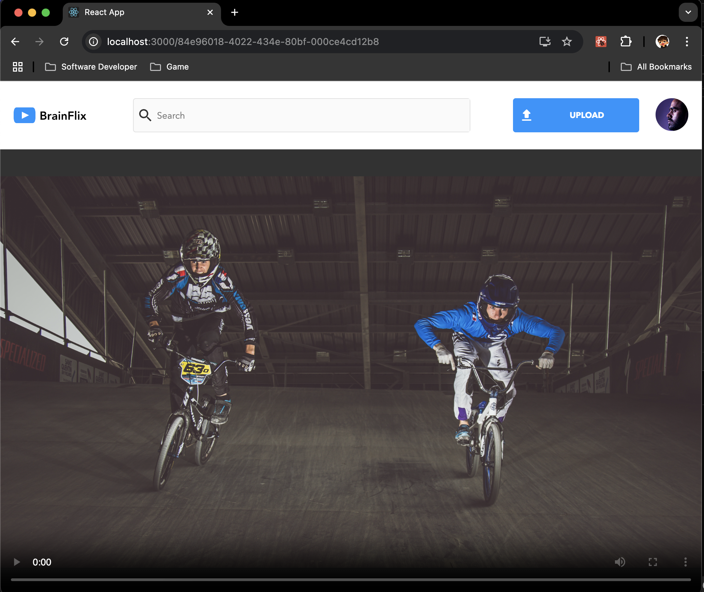
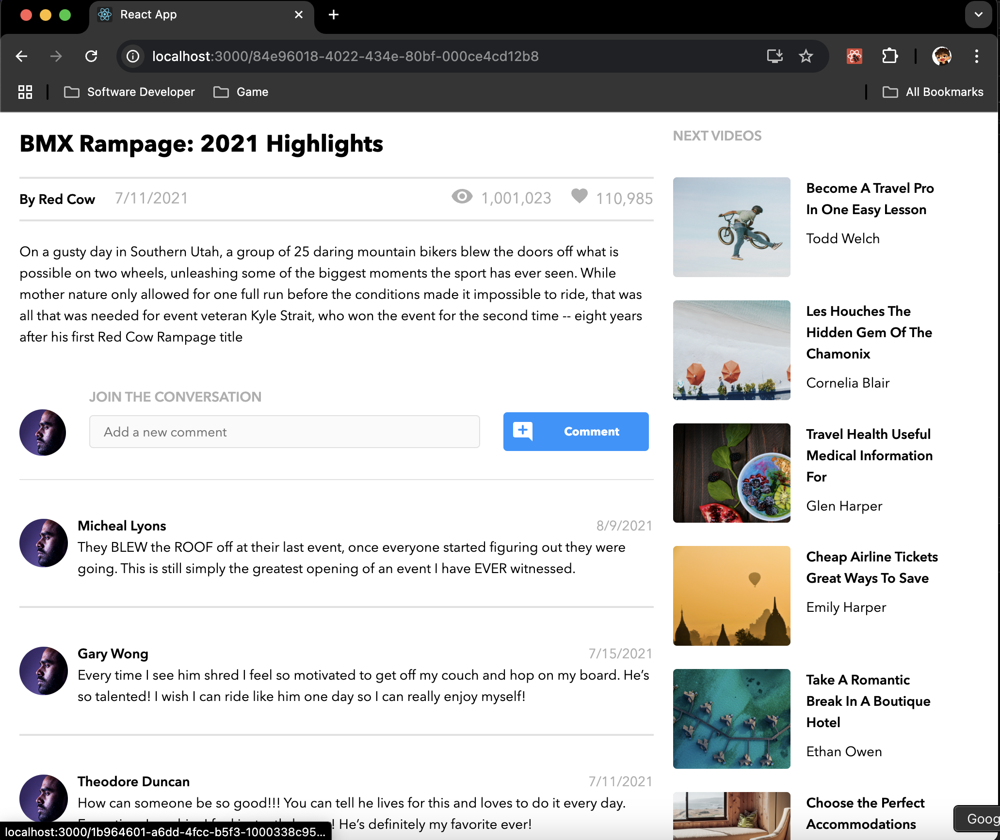
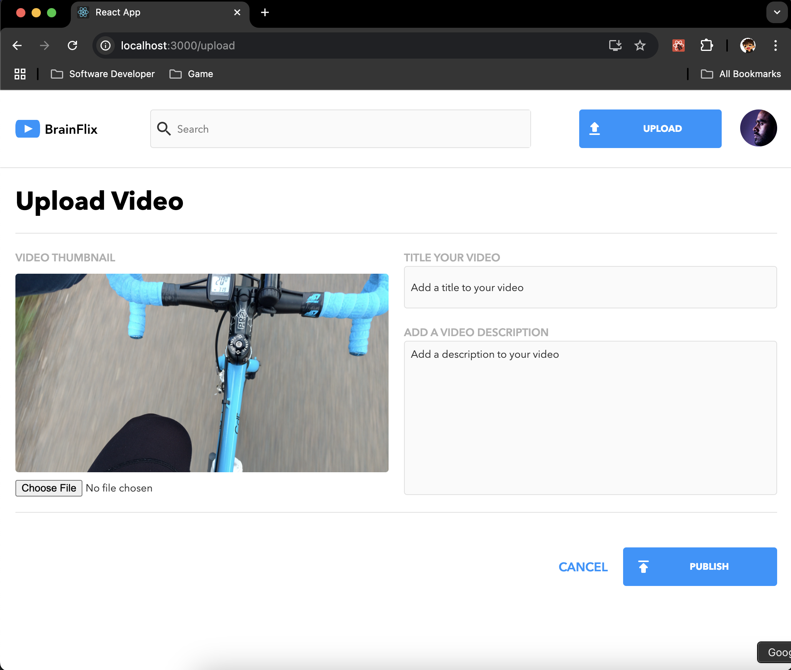

Brainflix 🎥

Brainflix is a dynamic video-sharing application initially developed during my time at the BrainStation bootcamp and later revisited to enhance its functionality and structure. This app allows users to explore, upload, and comment on videos, replicating the core features of a modern video platform.

Features ✨

    •	Video List: Browse all available videos with a concise overview.
    •	Detailed View: Click on a video to access its full details, including comments and metadata.
    •	Post Comments: Engage in discussions by adding comments to videos.
    •	Upload Videos: Add new videos with custom titles, descriptions, and optional thumbnails.
    •	Responsive UI: Optimized for both desktop and mobile experiences.

Project Structure 🗂️

Server

Contains the backend logic to serve video data and handle uploads:

/server  
├── /data  
│ └── videos.json  
├── /public  
│ └── /images  
├── /routes  
│ └── videos.js  
├── index.js  
└── .gitignore

    •	/data: Stores the JSON data for videos.
    •	/public: Hosts static files, including images for uploaded videos.
    •	/routes: Contains route handlers for all API endpoints.
    •	index.js: Entry point for the Express server.

Client

Contains the frontend React application:

/client  
├── /public  
├── /src  
│ ├── /assets  
│ │ ├── /fonts  
│ │ └── /images  
│ ├── /components  
│ │ ├── CommentSection  
│ │ ├── DescriptionSection  
│ │ ├── Header  
│ │ ├── HeroSection  
│ │ └── NextVidsSection  
│ ├── /pages  
│ │ ├── HomePage  
│ │ └── UploadPage  
│ ├── /styles  
│ │ └── /partials  
│ │ ├── \_global.scss  
│ │ ├── \_mixin.scss  
│ │ ├── \_typography.scss  
│ │ └── \_variables.scss  
│ ├── App.jsx  
│ └── index.jsx

    •	/assets: Contains fonts and images used across the app.
    •	/components: Reusable UI components, each with its own .jsx and .scss files.
    •	/pages: Main pages for the application (HomePage and UploadPage).
    •	/styles: Global and reusable SCSS files for styling.

Tech Stack 🛠️

Frontend

    •	React
    •	SCSS
    •	React Router

Backend

    •	Node.js
    •	Express.js
    •	File Upload with express-fileupload
    •	JSON file-based storage

Setup and Installation 🚀

Prerequisites

    •	Node.js
    •	npm

Installation

    1.	Clone the Repository:

git clone <repository-url>  
cd brainflix

    2.	Install Dependencies for Both Client and Server:

cd client  
npm install  
cd ../server  
npm install

    3.	Run the Backend Server:

node index.js

    4.	Run the Frontend Development Server:

cd ../client  
npm start

The backend runs on http://localhost:8080, while the frontend runs on http://localhost:3000.

API Endpoints 🌐

GET /videos

Fetch all videos in the database.

GET /videos/:id

Retrieve details of a specific video by ID.

POST /videos

Upload a new video with a title, description, and optional thumbnail.

GET /videos/:id/comments

Fetch the list of comments for a video.

POST /videos/:id/comments

Add a comment to a specific video.

Reflection 🧠

Brainflix was originally created during my BrainStation bootcamp to simulate a full-stack development workflow. Revisiting this project allowed me to modernize the codebase, implement better practices, and extend functionality. It’s been a great opportunity to consolidate my skills in React, Node.js, and API development.

Future Enhancements 🌟

    •	Add user authentication for personalized experiences.
    •	Enable video uploads and storage using cloud services.
    •	Improve video playback with streaming capabilities.
    •	Add search and filtering features for better usability.

License 📄

This project is licensed under the MIT License. See the LICENSE file for details.

Acknowledgments 💡

    •	BrainStation for providing the foundational learning experience.
    •	My peers and mentors for their support and guidance.

Screenshots

